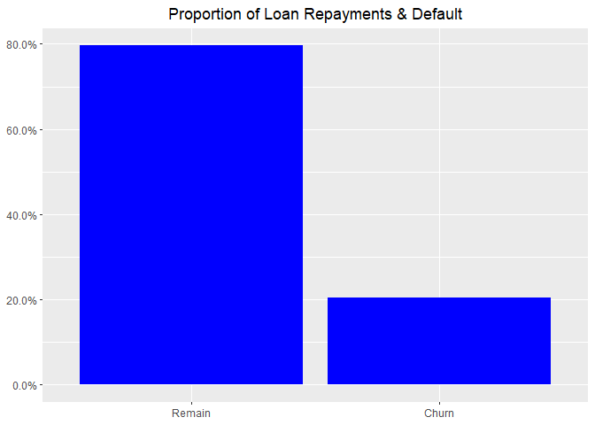
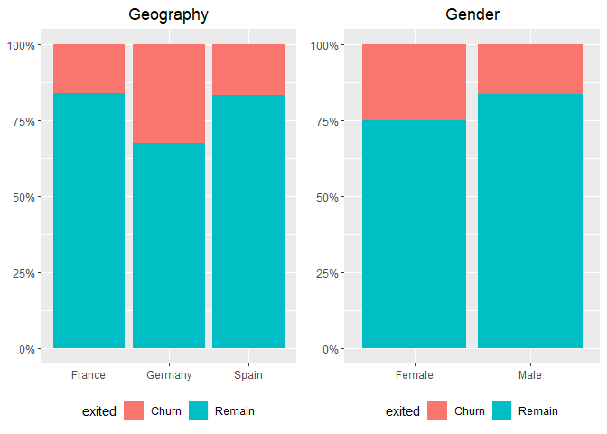
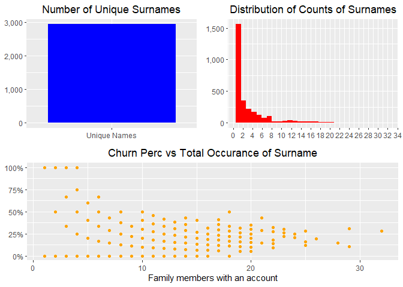

Exploring Tidymodels
================
registea
13/07/2020

# 

# 

# 


# 

# 

# 

<style type="text/css"> 

body{ /* Normal  */ 
      font-size: 16px; 
  } 
td {  /* Table  */ 
  font-size: 12px; 
} 
h1.title { 
  font-size: 38px; 
  color: Red; 
} 
h1 { /* Header 1 */ 
  font-size: 30px; 
  color: Red; 
} 
h2 { /* Header 2 */ 
    font-size: 26px; 
  color: Red; 
} 
h3 { /* Header 3 */ 
  font-size: 22px; 
  font-family: "Aerial", Times, serif; 
  color: Red; 
} 
code.r{ /* Code block */ 
    font-size: 12px; 
} 
pre { /* Code block - determines code spacing between lines */ 
    font-size: 14px; 
} 
</style>

# Introduction

The primary objective of this notebook is to explore the tidymodels
predictive model framework. I am familiar with the caret package but as
Max Kuhn has replaced caret with tidymodels and it has been available
for a couple of years, I thought it a good time to take it for a test
ride. To enable me to explore the framework a churn
[dataset](https://www.kaggle.com/shrutimechlearn/churn-modelling)
provided by **Shurti\_lyyer** on Kaggle will be used. The objective of
this analysis is to complete a binary classification to identify whether
a customer will leave the business.

From reading online, within the tidymodels framework the key packages
are:

  - rsample - Different types of re-samples
  - recipes - Transformations for model data pre-processing
  - parnip - A common interface for model creation
  - tune - Framework for hyperparameter tuning
  - dials - Specific hyperparameter tuning functions
  - yardstick - Measure model performance

<!-- end list -->

``` r
# Modelling Framework
library(tidymodels) # Predictive Framework
library(caret) # Predictive Framework

# Modelling AlgorithmsS
library(glmnet) # Glmnet regression
library(rpart) # Decision Trees
library(ranger) # Random Forests

# Formating, Visualisations and tables
library(scales) # Number formats
library(knitr) # Table
library(gridExtra) # multiplot
library(e1071) # Summary distribution
library(skimr) # Summarise dataframe
library(naniar) # Missing data summary
library(corrplot) # Correlation plot
library(probably) # Probability thresholds

# Data handling Packages
library(tidyverse) # Data handling/ Graphics
library(data.table) # Data handling
```

# Data loading

To kick start this project, the fread function from the data.table
package is used to load the data into memory.

``` r
# Load data
df_churn <- 
  data.table::fread("C:/Users/Anthony/Documents/Git/Project Portfolio/tidymodels_exploration/Churn_Modelling.csv")
```

# Exploratory Data Analysis

The skim function from the **skimr** package produces the summary output
below, showing that we have 10,000 observations and 14 variables. There
are 3 character variables and 11 numeric.

The character variables relate to gender, geography and customer’s
surname. The numerical variables have two references of Id (rows and
customer). Beyond this, data relates to age, tenure, credit, income and
our final variable of whether the customer churned (labelled as Exited).

``` r
# Summarise datafrmae
skim(df_churn)
```

|                                                  |           |
| :----------------------------------------------- | :-------- |
| Name                                             | df\_churn |
| Number of rows                                   | 10000     |
| Number of columns                                | 14        |
| \_\_\_\_\_\_\_\_\_\_\_\_\_\_\_\_\_\_\_\_\_\_\_   |           |
| Column type frequency:                           |           |
| character                                        | 3         |
| numeric                                          | 11        |
| \_\_\_\_\_\_\_\_\_\_\_\_\_\_\_\_\_\_\_\_\_\_\_\_ |           |
| Group variables                                  | None      |

Data summary

**Variable type: character**

| skim\_variable | n\_missing | complete\_rate | min | max | empty | n\_unique | whitespace |
| :------------- | ---------: | -------------: | --: | --: | ----: | --------: | ---------: |
| Surname        |          0 |              1 |   2 |  23 |     0 |      2932 |          0 |
| Geography      |          0 |              1 |   5 |   7 |     0 |         3 |          0 |
| Gender         |          0 |              1 |   4 |   6 |     0 |         2 |          0 |

**Variable type: numeric**

| skim\_variable  | n\_missing | complete\_rate |        mean |       sd |          p0 |         p25 |         p50 |         p75 |       p100 | hist  |
| :-------------- | ---------: | -------------: | ----------: | -------: | ----------: | ----------: | ----------: | ----------: | ---------: | :---- |
| RowNumber       |          0 |              1 |     5000.50 |  2886.90 |        1.00 |     2500.75 |     5000.50 |     7500.25 |    10000.0 | ▇▇▇▇▇ |
| CustomerId      |          0 |              1 | 15690940.57 | 71936.19 | 15565701.00 | 15628528.25 | 15690738.00 | 15753233.75 | 15815690.0 | ▇▇▇▇▇ |
| CreditScore     |          0 |              1 |      650.53 |    96.65 |      350.00 |      584.00 |      652.00 |      718.00 |      850.0 | ▁▃▇▇▃ |
| Age             |          0 |              1 |       38.92 |    10.49 |       18.00 |       32.00 |       37.00 |       44.00 |       92.0 | ▅▇▂▁▁ |
| Tenure          |          0 |              1 |        5.01 |     2.89 |        0.00 |        3.00 |        5.00 |        7.00 |       10.0 | ▇▆▆▆▅ |
| Balance         |          0 |              1 |    76485.89 | 62397.41 |        0.00 |        0.00 |    97198.54 |   127644.24 |   250898.1 | ▇▃▇▂▁ |
| NumOfProducts   |          0 |              1 |        1.53 |     0.58 |        1.00 |        1.00 |        1.00 |        2.00 |        4.0 | ▇▇▁▁▁ |
| HasCrCard       |          0 |              1 |        0.71 |     0.46 |        0.00 |        0.00 |        1.00 |        1.00 |        1.0 | ▃▁▁▁▇ |
| IsActiveMember  |          0 |              1 |        0.52 |     0.50 |        0.00 |        0.00 |        1.00 |        1.00 |        1.0 | ▇▁▁▁▇ |
| EstimatedSalary |          0 |              1 |   100090.24 | 57510.49 |       11.58 |    51002.11 |   100193.91 |   149388.25 |   199992.5 | ▇▇▇▇▇ |
| Exited          |          0 |              1 |        0.20 |     0.40 |        0.00 |        0.00 |        0.00 |        0.00 |        1.0 | ▇▁▁▁▂ |

The skim output shows that most of the variable names have a mixture of
upper and lower case characters. The set\_names functions coverts all
variable names to lower case. This makes the programming a little bit
easier. Further to this there is a variable ‘RowNumber’ and ‘customerid’
which just references the row of each observation and a unique
identifier for each customer. These can be removed from the analysis.

``` r
# Convert all names to lower case
df_churn <-
  df_churn %>%
    set_names(., tolower(names(.))) %>%
    select(-c(rownumber, customerid))
```

## Exploring Target Variable

The target variable in this dataset is **exited**, the chart below shows
that roughly 80% of customers remain while the remaining 20% of
customers churn. This is a fairly unbalanced data, so we might have to
treat that at another time. The target variable is stored as numeric, I
will convert it to a factor with levels relating to remain and churn.



## Exploring Categorical Variables

The chart below indicates that male customers have a lower risk of
churning that female customers. Looking at the Geography variable, there
doesn’t appear to be a difference between the underlying rates of churn
for customers from France and Spain. However, comparing the both of
those to Germany, they both have much lower likelihood of churn.



The final categorical variable is the customer’s surname, of the 10,000
observations, there are just under 3,000 unique surnames. This indicates
that some customers come from families (some quite large) who all have
accounts with the same bank. The histogram indicates that the majority
of the bank customers are the only one from their family that bank
there. However, a number of customers do have multiple family members.
There appears to be a relationship that the larger the family size who
have an account the lower the churn rate. In the following section it
could be good to explore additional ways of including the surname into
the model.

``` r
# Land and structure based variables
grid.arrange(
             widths = c(1, 1, 1, 1, 1, 1, 1, 1, 1, 1, 1, 1),
             layout_matrix = 
                      rbind(c(1, 1, 1, 1, 1, 1, 2, 2, 2, 2, 2, 2),
                            c(1, 1, 1, 1, 1, 1, 2, 2, 2, 2, 2, 2),
                            c(1, 1, 1, 1, 1, 1, 2, 2, 2, 2, 2, 2),
                            c(1, 1, 1, 1, 1, 1, 2, 2, 2, 2, 2, 2),
                            c(1, 1, 1, 1, 1, 1, 2, 2, 2, 2, 2, 2),
                            c(1, 1, 1, 1, 1, 1, 2, 2, 2, 2, 2, 2),
                            c(3, 3, 3, 3, 3, 3, 3, 3, 3, 3, 3, 3),
                            c(3, 3, 3, 3, 3, 3, 3, 3, 3, 3, 3, 3),
                            c(3, 3, 3, 3, 3, 3, 3, 3, 3, 3, 3, 3),
                            c(3, 3, 3, 3, 3, 3, 3, 3, 3, 3, 3, 3),
                            c(3, 3, 3, 3, 3, 3, 3, 3, 3, 3, 3, 3),
                            c(3, 3, 3, 3, 3, 3, 3, 3, 3, 3, 3, 3)),

            # Unique surname
            df_churn %>%
              select(surname) %>%
              unique() %>%
              count() %>%
              ggplot(aes(x = "Unique Names", y = n)) +
              geom_col(fill = "blue") +
              scale_y_continuous(labels = scales::comma) +
              labs(y = NULL, x = NULL) +
              theme(plot.title = element_text(hjust = 0.5),
                    legend.position = "top") +
              ggtitle("Number of Unique Surnames"), 
            
            
            # Distribution of Family Names
            df_churn %>%
              group_by(surname, exited) %>%
              count() %>%
              spread(exited, n) %>%
              replace_na(list(Churn = 0, Remain = 0)) %>%
              mutate(Total = Churn + Remain) %>%
              arrange(desc(Total)) %>%
              ungroup() %>%
              ggplot(aes(x = Total)) +
                geom_histogram(fill = "red") +
                scale_x_continuous(breaks = seq(0,35,2)) +
                scale_y_continuous(labels = scales::comma) +
                labs(y = NULL, x = NULL) +
                theme(plot.title = element_text(hjust = 0.5),
                      legend.position = "top") +
                ggtitle("Distribution of Counts of Surnames"), 
            
            # Distribution of surname
            df_churn %>%
              group_by(surname, exited) %>%
              count() %>%
              spread(exited, n) %>%
              replace_na(list(Churn = 0, Remain = 0)) %>%
              mutate(Total = Churn + Remain,
                     churn_perc = Churn / Total) %>%
              ggplot(aes(x = Total, y = churn_perc)) +
              geom_point(col = "orange") +
              scale_y_continuous(labels = scales::percent) +
              labs(y = NULL, x = "Family members with an account") +
              theme(plot.title = element_text(hjust = 0.5),
                    legend.position = "top") +
              ggtitle("Churn Perc vs Total Occurance of Surname")
)
```

<!-- -->
