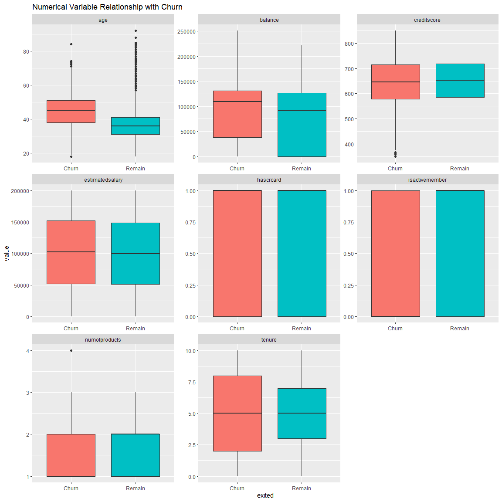
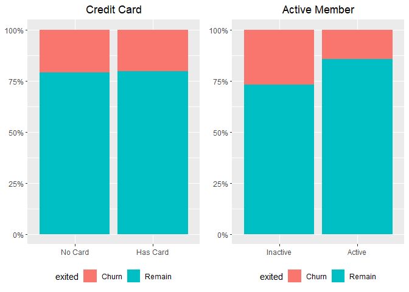
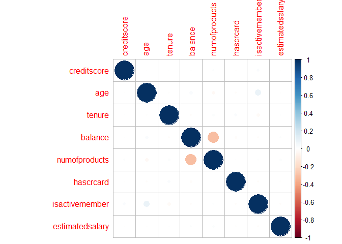
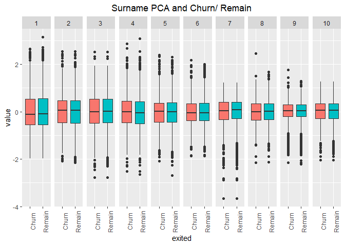

Exploring Tidymodels
================
registea
13/07/2020

# 

# 

# 


# 

# 

# 

<style type="text/css"> 

body{ /* Normal  */ 
      font-size: 16px; 
  } 
td {  /* Table  */ 
  font-size: 12px; 
} 
h1.title { 
  font-size: 38px; 
  color: Red; 
} 
h1 { /* Header 1 */ 
  font-size: 30px; 
  color: Red; 
} 
h2 { /* Header 2 */ 
    font-size: 26px; 
  color: Red; 
} 
h3 { /* Header 3 */ 
  font-size: 22px; 
  font-family: "Aerial", Times, serif; 
  color: Red; 
} 
code.r{ /* Code block */ 
    font-size: 12px; 
} 
pre { /* Code block - determines code spacing between lines */ 
    font-size: 14px; 
} 
</style>

# Introduction

The primary objective of this notebook is to explore the tidymodels
predictive model framework. I am familiar with the caret package but as
Max Kuhn has replaced caret with tidymodels and it has been available
for a couple of years, I thought it a good time to take it for a test
ride. To enable me to explore the framework a churn
[dataset](https://www.kaggle.com/shrutimechlearn/churn-modelling)
provided by **Shurti\_lyyer** on Kaggle will be used. The objective of
this analysis is to complete a binary classification to identify whether
a customer will leave the business.

From reading online, within the tidymodels framework the key packages
are:

  - rsample - Different types of re-samples
  - recipes - Transformations for model data pre-processing
  - parnip - A common interface for model creation
  - tune - Framework for hyperparameter tuning
  - dials - Specific hyperparameter tuning functions
  - yardstick - Measure model performance

<!-- end list -->

``` r
# Modelling Framework
library(tidymodels) # Predictive Framework
library(caret) # Predictive Framework

# Modelling AlgorithmsS
library(glmnet) # Glmnet regression
library(rpart) # Decision Trees
library(ranger) # Random Forests

# Formating, Visualisations and tables
library(scales) # Number formats
library(knitr) # Table
library(gridExtra) # multiplot
library(e1071) # Summary distribution
library(skimr) # Summarise dataframe
library(naniar) # Missing data summary
library(corrplot) # Correlation plot
library(probably) # Probability thresholds

# Data handling Packages
library(tidyverse) # Data handling/ Graphics
library(data.table) # Data handling
```

# Data loading

To kick start this project, the fread function from the data.table
package is used to load the data into memory.

``` r
# Load data
df_churn <- 
  data.table::fread("C:/Users/Anthony/Documents/Git/Project Portfolio/tidymodels_exploration/Churn_Modelling.csv")
```

# Exploratory Data Analysis

The skim function from the **skimr** package produces the summary output
below, showing that we have 10,000 observations and 14 variables. There
are 3 character variables and 11 numeric.

The character variables relate to gender, geography and customer’s
surname. The numerical variables have two references of Id (rows and
customer). Beyond this, data relates to age, tenure, credit, income and
our final variable of whether the customer churned (labelled as Exited).

``` r
# Summarise datafrmae
skim(df_churn)
```

|                                                  |           |
| :----------------------------------------------- | :-------- |
| Name                                             | df\_churn |
| Number of rows                                   | 10000     |
| Number of columns                                | 14        |
| \_\_\_\_\_\_\_\_\_\_\_\_\_\_\_\_\_\_\_\_\_\_\_   |           |
| Column type frequency:                           |           |
| character                                        | 3         |
| numeric                                          | 11        |
| \_\_\_\_\_\_\_\_\_\_\_\_\_\_\_\_\_\_\_\_\_\_\_\_ |           |
| Group variables                                  | None      |

Data summary

**Variable type: character**

| skim\_variable | n\_missing | complete\_rate | min | max | empty | n\_unique | whitespace |
| :------------- | ---------: | -------------: | --: | --: | ----: | --------: | ---------: |
| Surname        |          0 |              1 |   2 |  23 |     0 |      2932 |          0 |
| Geography      |          0 |              1 |   5 |   7 |     0 |         3 |          0 |
| Gender         |          0 |              1 |   4 |   6 |     0 |         2 |          0 |

**Variable type: numeric**

| skim\_variable  | n\_missing | complete\_rate |        mean |       sd |          p0 |         p25 |         p50 |         p75 |       p100 | hist  |
| :-------------- | ---------: | -------------: | ----------: | -------: | ----------: | ----------: | ----------: | ----------: | ---------: | :---- |
| RowNumber       |          0 |              1 |     5000.50 |  2886.90 |        1.00 |     2500.75 |     5000.50 |     7500.25 |    10000.0 | ▇▇▇▇▇ |
| CustomerId      |          0 |              1 | 15690940.57 | 71936.19 | 15565701.00 | 15628528.25 | 15690738.00 | 15753233.75 | 15815690.0 | ▇▇▇▇▇ |
| CreditScore     |          0 |              1 |      650.53 |    96.65 |      350.00 |      584.00 |      652.00 |      718.00 |      850.0 | ▁▃▇▇▃ |
| Age             |          0 |              1 |       38.92 |    10.49 |       18.00 |       32.00 |       37.00 |       44.00 |       92.0 | ▅▇▂▁▁ |
| Tenure          |          0 |              1 |        5.01 |     2.89 |        0.00 |        3.00 |        5.00 |        7.00 |       10.0 | ▇▆▆▆▅ |
| Balance         |          0 |              1 |    76485.89 | 62397.41 |        0.00 |        0.00 |    97198.54 |   127644.24 |   250898.1 | ▇▃▇▂▁ |
| NumOfProducts   |          0 |              1 |        1.53 |     0.58 |        1.00 |        1.00 |        1.00 |        2.00 |        4.0 | ▇▇▁▁▁ |
| HasCrCard       |          0 |              1 |        0.71 |     0.46 |        0.00 |        0.00 |        1.00 |        1.00 |        1.0 | ▃▁▁▁▇ |
| IsActiveMember  |          0 |              1 |        0.52 |     0.50 |        0.00 |        0.00 |        1.00 |        1.00 |        1.0 | ▇▁▁▁▇ |
| EstimatedSalary |          0 |              1 |   100090.24 | 57510.49 |       11.58 |    51002.11 |   100193.91 |   149388.25 |   199992.5 | ▇▇▇▇▇ |
| Exited          |          0 |              1 |        0.20 |     0.40 |        0.00 |        0.00 |        0.00 |        0.00 |        1.0 | ▇▁▁▁▂ |

The skim output shows that most of the variable names have a mixture of
upper and lower case characters. The set\_names functions coverts all
variable names to lower case. This makes the programming a little bit
easier. Further to this there is a variable ‘RowNumber’ and ‘customerid’
which just references the row of each observation and a unique
identifier for each customer. These can be removed from the analysis.

``` r
# Convert all names to lower case
df_churn <-
  df_churn %>%
    set_names(., tolower(names(.))) %>%
    select(-c(rownumber, customerid))
```

## Exploring Target Variable

The target variable in this dataset is **exited**, the chart below shows
that roughly 80% of customers remain while the remaining 20% of
customers churn. This is a fairly unbalanced data, so we might have to
treat that at another time. The target variable is stored as numeric, I
will convert it to a factor with levels relating to remain and churn.


## Exploring Categorical Variables

The chart below indicates that male customers have a lower risk of
churning that female customers. Looking at the Geography variable, there
doesn’t appear to be a difference between the underlying rates of churn
for customers from France and Spain. However, comparing the both of
those to Germany, they both have much lower likelihood of churn.


The final categorical variable is the customer’s surname, of the 10,000
observations, there are just under 3,000 unique surnames. This indicates
that some customers come from families (some quite large) who all have
accounts with the same bank. The histogram indicates that the majority
of the bank customers are the only one from their family that bank
there. However, a number of customers do have multiple family members.
There appears to be a relationship that the larger the family size who
have an account the lower the churn rate. In the following section it
could be good to explore additional ways of including the surname into
the model.

``` r
# Land and structure based variables
grid.arrange(
             widths = c(1, 1, 1, 1, 1, 1, 1, 1, 1, 1, 1, 1),
             layout_matrix = 
                      rbind(c(1, 1, 1, 1, 1, 1, 2, 2, 2, 2, 2, 2),
                            c(1, 1, 1, 1, 1, 1, 2, 2, 2, 2, 2, 2),
                            c(1, 1, 1, 1, 1, 1, 2, 2, 2, 2, 2, 2),
                            c(1, 1, 1, 1, 1, 1, 2, 2, 2, 2, 2, 2),
                            c(1, 1, 1, 1, 1, 1, 2, 2, 2, 2, 2, 2),
                            c(1, 1, 1, 1, 1, 1, 2, 2, 2, 2, 2, 2),
                            c(3, 3, 3, 3, 3, 3, 3, 3, 3, 3, 3, 3),
                            c(3, 3, 3, 3, 3, 3, 3, 3, 3, 3, 3, 3),
                            c(3, 3, 3, 3, 3, 3, 3, 3, 3, 3, 3, 3),
                            c(3, 3, 3, 3, 3, 3, 3, 3, 3, 3, 3, 3),
                            c(3, 3, 3, 3, 3, 3, 3, 3, 3, 3, 3, 3),
                            c(3, 3, 3, 3, 3, 3, 3, 3, 3, 3, 3, 3)),

            # Unique surname
            df_churn %>%
              select(surname) %>%
              unique() %>%
              count() %>%
              ggplot(aes(x = "Unique Names", y = n)) +
              geom_col(fill = "blue") +
              scale_y_continuous(labels = scales::comma) +
              labs(y = NULL, x = NULL) +
              theme(plot.title = element_text(hjust = 0.5),
                    legend.position = "top") +
              ggtitle("Number of Unique Surnames"), 
            
            
            # Distribution of Family Names
            df_churn %>%
              group_by(surname, exited) %>%
              count() %>%
              spread(exited, n) %>%
              replace_na(list(Churn = 0, Remain = 0)) %>%
              mutate(Total = Churn + Remain) %>%
              arrange(desc(Total)) %>%
              ungroup() %>%
              ggplot(aes(x = Total)) +
                geom_histogram(fill = "red") +
                scale_x_continuous(breaks = seq(0,35,2)) +
                scale_y_continuous(labels = scales::comma) +
                labs(y = NULL, x = NULL) +
                theme(plot.title = element_text(hjust = 0.5),
                      legend.position = "top") +
                ggtitle("Distribution of Counts of Surnames"), 
            
            # Distribution of surname
            df_churn %>%
              group_by(surname, exited) %>%
              count() %>%
              spread(exited, n) %>%
              replace_na(list(Churn = 0, Remain = 0)) %>%
              mutate(Total = Churn + Remain,
                     churn_perc = Churn / Total) %>%
              ggplot(aes(x = Total, y = churn_perc)) +
              geom_point(col = "orange") +
              scale_y_continuous(labels = scales::percent) +
              labs(y = NULL, x = "Family members with an account") +
              theme(plot.title = element_text(hjust = 0.5),
                    legend.position = "top") +
              ggtitle("Churn Perc vs Total Occurance of Surname")
)
```

<!-- -->

## Exploring Numerical Variables

The plot looks at the relationship between each numeric variable and
churn. Two of the variables ‘hascrcard’ and ‘isactivemember’ are binary
variables and should be visualised in a different form. The remaining
variables can be summarised as:

  - Age: There appears to be a relationship that customers that churn
    are older on average than customers that don’t
  - Balance: The average balance of customers who churn and remain are
    similar. However, those who churn tend to have a higher balance
  - Credit score: There doesn’t appear to be much of a difference with
    regards to creditscore
  - Estimated salary: Again there doesn’t appear to be much of a
    difference with regard to salary
  - Number of products: On average customers that remain have more than
    one product, while customers that leave have only one
  - Tenure: There is a wider distribution of tenure within customers
    that churn, it appears that newer and older customers could have a
    higher likelihood of churning

<!-- end list -->

``` r
# Relationship with Churn and Numerical variables
df_churn %>%
  {bind_cols(select_if(., is.numeric),
             select_at(., "exited"))
  } %>%
  gather(-exited, key = "var", value = "value") %>%
  ggplot(aes(x = exited, y = value, fill = exited)) +
    geom_boxplot() +
    theme(legend.position = "none") + 
    facet_wrap(~ var, scales = "free")  +
    ggtitle("Numerical Variable Relationship with Churn")
```



As mentioned above the ‘credit card’ and ‘Active member’ variables
shouldn’t be visualised using a boxplot. To generate the following plot,
the variables are firstly converted to factors and then the plot
explores whether there is a relationship with churn. Having a credit
card doesn’t appear to impact the customers likelihood to churn.
Alternatively, whether the customer is considered active, definately has
a relationship, ‘Active’ customers have much lower liklihood of
churning.



The plot below indicates that the numerical predictors are not
particularly correlated, so no actions are required to address
multicollinariety.

``` r
# Create a variable of total family size
corrplot(cor(df_churn %>% select_if(is.numeric)))
```

<!-- -->

# Feature Engineering

An important part of the model building process is to try and create new
predictors which will improve the accuracy of the model. The information
gained from the exploratory analysis, provides a couple of ideas as to
which variables can be generated.

### Surname

Given that the surname has circa 3k unique entries, it is unlikely that
the variable will be entered into the model. Instead some of the
information embedded will be used to generate new variables. The first
variable which will be created is a count of the total number of family
members with the same surname. As seen in the section above this
appeared to show a negatively correlated relationship.

``` r
# Create a variable of total family size
df_churn <-
  df_churn %>%
  left_join(df_churn %>%
              group_by(surname, exited) %>%
              count() %>%
              spread(exited, n) %>%
              replace_na(list(Churn = 0, Remain = 0)) %>%
              mutate(total_family = Churn + Remain) %>%
              select(surname, total_family),
            by = "surname")
```

Without commiting to thorough text analytics, there might be some value
in seeing if the attributes of a customer’s name has a relationship with
whether they churn. A simple approach is taken here, firstly 26 new
columns are created to capture each letter of the alphabet a:z. Then for
each surname those columns are populated with the counts of times the
letter appeared in the customer’s name. The final step is to try and
reduce the new 26 columns down, a Principle Component Analysis (PCA) was
conducted to achieve this. The output below shows that the first 10
principle components represent 75% of the variation in the letters
associated with customer’s names.

``` r
#Create a df with 26 columns
df_alphabet <-  
  cbind(
        df_churn %>%
          select(surname),
        matrix(0, nrow = nrow(df_churn), ncol = 26) %>%
        as.data.frame() %>%
        set_names(., c("a", "b", "c", "d", "e", "f", "g", "h", 
                       "i", "j", "k", "l", "m", "n", "o", "p", 
                       "q", "r", "s", "t", "u", "v", "w", "x", 
                       "y", "z"))
        )

# Fill df with counts of letters in customer's name
df_alphabet[2:ncol(df_alphabet)] <-
  sapply(names(df_alphabet[2:ncol(df_alphabet)]), function(x) {str_count(df_alphabet[,1], x)})
  

# Create PCA analysis and plot
pca <- prcomp(df_alphabet[2:ncol(df_alphabet)])
summary(pca) 
```

    ## Importance of components:
    ##                           PC1    PC2    PC3     PC4     PC5     PC6     PC7
    ## Standard deviation     0.7707 0.7152 0.6944 0.66855 0.62850 0.58522 0.56174
    ## Proportion of Variance 0.1188 0.1023 0.0965 0.08943 0.07904 0.06853 0.06314
    ## Cumulative Proportion  0.1188 0.2212 0.3177 0.40713 0.48617 0.55470 0.61784
    ##                            PC8     PC9    PC10    PC11    PC12    PC13    PC14
    ## Standard deviation     0.50341 0.46637 0.44802 0.41093 0.39631 0.36110 0.34823
    ## Proportion of Variance 0.05071 0.04352 0.04016 0.03379 0.03143 0.02609 0.02426
    ## Cumulative Proportion  0.66855 0.71207 0.75223 0.78602 0.81745 0.84354 0.86781
    ##                           PC15   PC16    PC17    PC18    PC19    PC20    PC21
    ## Standard deviation     0.33924 0.3209 0.29870 0.28208 0.26311 0.25269 0.22539
    ## Proportion of Variance 0.02303 0.0206 0.01785 0.01592 0.01385 0.01278 0.01016
    ## Cumulative Proportion  0.89083 0.9114 0.92929 0.94521 0.95906 0.97184 0.98201
    ##                           PC22    PC23    PC24    PC25    PC26
    ## Standard deviation     0.19837 0.18813 0.08883 0.08001 0.02989
    ## Proportion of Variance 0.00787 0.00708 0.00158 0.00128 0.00018
    ## Cumulative Proportion  0.98988 0.99696 0.99854 0.99982 1.00000

The plot below shows the distribution of churn and remain for the first
10 principle components just created. There doesn’t appear to be much
variation based on the name based components, however this will be
explored more rigourously during feature selection.

``` r
# Visualise relationship with churn
cbind(df_churn %>% select(exited), pca$x[,1:10]) %>%
  gather(-exited, key = "var", value = "value") %>%
  mutate(var = as.numeric(substr(var, 3,4))) %>%
  ggplot(aes(x = exited, y = value, fill = exited)) +
    geom_boxplot() +
    facet_grid(. ~ var) +
    theme(axis.text.x = element_text(angle = 90),
          legend.position = "none",
          plot.title = element_text(hjust = 0.5)) +
    ggtitle("Surname PCA and Churn/ Remain")
```

<!-- -->

``` r
# Update churn dataframe
df_churn <-
  cbind(df_churn,
        pca$x[,1:10]) %>%
  rename_at(vars(starts_with('PC')), funs(paste0('Name', .)))

rm(df_alphabet, pca) # reduce memory size
```

#### Tenure

The exploratory analysis revealed that the distribution of tenure for
customers who left the bank was a lot wider than those who remained. It
suggested that maybe newer and longer standing customers were at higher
risk of churn, while medium term customers had a lower likelihood. As
such a new variable will be created which splits tenure into less than 3
being a new cusotmer and being longer than 7 being older customer.

``` r
# Create a variable
df_churn <-
  df_churn %>%
    mutate(tenure_fct = factor(case_when(tenure <= 3 ~ "New",
                                         tenure >= 7 ~ "Long",
                                         TRUE ~ "Medium"),
                               level = c("New", "Medium", "Long")))
```
